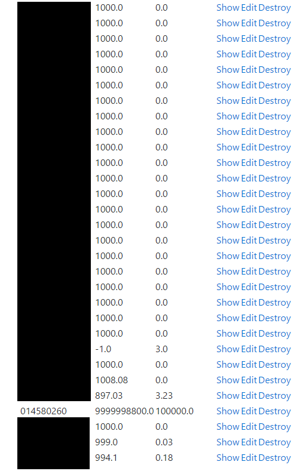

### Hack a Bank
> The marketplace in CyberBank (https://cyber-bank.testmycode.io/) has information for sale that your 'friend' requires. Sadly, you lack the necessary funds to acquire this information. Use your hacking skills to obtain more currency and obtain the information.

I solved this challenge in under 30 seconds because I had "mysteriously" acquired a decent amount of money in the bank. The same site was used in an earlier challenge and there was a note about how more functionality will be available as the CTF progresses. After completing that earlier challenge I spent some time looking for anything interesting.

I eventually ended up at https://cyber-bank.testmycode.io/users/ which was mistakenly exposed (screenshot below). In it you could see everyone who had logged in to the bank and edit their currencies. I wasn't really sure if this was part of a upcoming challenge but I did the natural thing and added a bit of money for myself.

Hack a Bank challange required you to get from the starting balance of 1000 euros to 1200. I was at like 10 billion when the challenge went online. 

>Bank's owners password
>Sold by: camelCaravan64
>Hi folks, managed to aquire this password totally legitemately, and now I'm selling it for real cheap. Need money for rent and poker. Oh and one more thing: once I have your money, you'll never get it back. SO NO REFUNDS!
>Price: 1200 euros

And paying the 1200:
> Ok, so the key is: "itsnotsafeoutherehackersarebehindeverycorner". Pleasure doing business with you!

/users/ was removed after a quick note to the admin of the CTF.

